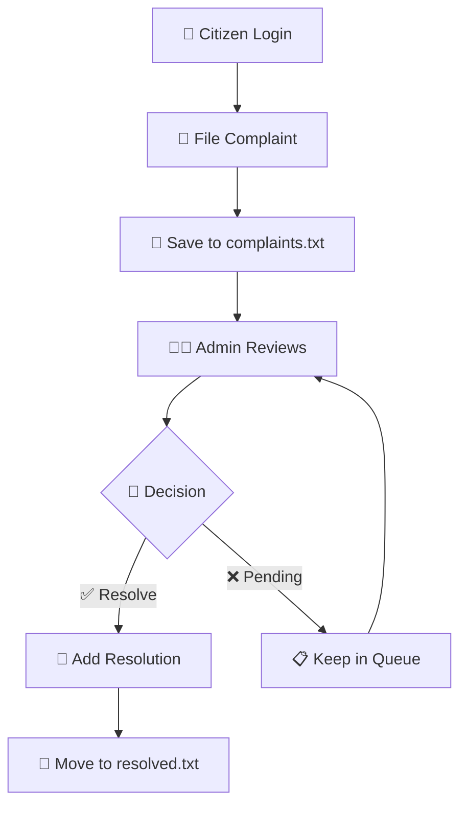

# 🌆 Smart City Complaint Management System  

> A **Java-based desktop + web-integrated application** to manage and resolve public complaints efficiently — built as part of a *6-day Java Programming Course* at **Ethnotech Lab**.

[](https://www.oracle.com/java/)
[](https://git-scm.com/)
[](https://github.com/)

---

## ✨ Features

| 🎯 Feature | 📋 Description |
|------------|----------------|
| 🔐 **Dual Authentication** | Separate login systems for Admin and Citizen users |
| 📝 **Complaint Filing** | Citizens can file complaints with detailed information |
| 📄 **Complaint Management** | Admins can view, process, and resolve complaints |
| 🌐 **Web Interface** | Built-in HTTP server for web-based complaint viewing |
| 💾 **File-based Storage** | Persistent data storage using text files |
| 🚀 **Real-time Processing** | Instant complaint status updates |

---

## 🛠️ Technologies & Tools

<div align="center">

| **Technology** | **Purpose** | **Version** |
|:--------------:|:----------:|:-----------:|
| ☕ **Java Core** | Application Logic & File Handling | JDK 8+ |
| 🌐 **Java HttpServer** | Lightweight Web Interface | Built-in |
| 📁 **File I/O** | Read/Write Complaints | Java NIO |
| 🔧 **Git & GitHub** | Version Control & Collaboration | Latest |

</div>

---

## 📁 Project Architecture

```
SmartCityApplication/
│
├── 📂 src/                     # Java source files
│   └── 📂 com.example/
│       ├── 👤 Admin.java       # Admin functionality
│       ├── 🏛️ Citizen.java     # Citizen operations
│       ├── 👥 Person.java      # Base person class
│       ├── 📊 ReportManager.java # Report handling logic
|       ├──  Complaint.java # Handling Complaints
│       └── 🚀 Main.java        # Application entry point
│
├── 📄 complaints.txt           # Pending complaints storage
├── ✅ resolved.txt             # Resolved complaints archive
├── 🚫 .gitignore              # Git ignore rules
└── 📖 README.md               # Project documentation
```

---

## 🚀 Quick Start

### Prerequisites

- ☕ **Java Development Kit (JDK) 8 or higher**
- 💻 **Any IDE or text editor** (IntelliJ IDEA, Eclipse, VS Code)
- 🌐 **Web browser** for accessing the web interface

### Installation & Setup

1. **📥 Clone the Repository**
   ```bash
   git clone https://github.com/ematty246/SmartCityApplication.git
   cd SmartCityApplication
   ```

2. **⚙️ Compile the Application**
   ```bash
   cd src
   javac com/example/*.java
   ```

3. **🎯 Run the Application**
   ```bash
   java com.example.Main
   ```

4. **🌐 Access Web Interface**
   ```
   Open your browser and navigate to: http://localhost:8081
   ```

---

## 📖 Usage Guide

### 👤 For Citizens

1. **📝 Register/Login**
   - Enter your personal details (Name, Age, ID)
   - Verify your information

2. **📋 File a Complaint**
   - Select complaint category
   - Provide detailed description
   - Submit complaint for review

3. **📊 Track Status**
   - View complaint status in real-time
   - Receive updates on resolution progress

### 👨‍💼 For Administrators

1. **🔑 Admin Access**
   - Login with Admin ID and password
   - Access administrative dashboard

2. **📄 View Complaints**
   - Review all pending complaints via web interface
   - Filter by category, date, or priority

3. **✅ Resolve Complaints**
   - Enter complaint ID to process
   - Add resolution notes
   - Mark complaint as resolved

---

## 🔄 System Workflow



---

## 🎓 Course Information

<div align="center">

| **Detail** | **Information** |
|:----------:|:---------------:|
| 📚 **Course** | Programming in Java |
| 🏢 **Institution** | Ethnotech Lab |
| ⏱️ **Duration** | 6 Days Intensive |
| 🎯 **Objective** | Hands-on Java Development |
| 🏆 **Outcome** | Production-ready Application |

</div>

---

## 🤝 Contributing

We welcome contributions! Please feel free to submit a Pull Request. For major changes, please open an issue first to discuss what you would like to change.

### Development Setup

1. Fork the repository
2. Create your feature branch (`git checkout -b feature/AmazingFeature`)
3. Commit your changes (`git commit -m 'Add some AmazingFeature'`)
4. Push to the branch (`git push origin feature/AmazingFeature`)
5. Open a Pull Request

---

## 📄 License

This project is licensed under the MIT License - see the [LICENSE](LICENSE) file for details.

---

## 👨‍💻 Author

**Emmanuel Matthew J**  
📧 Email: ematty2006@gmail.com  
🔗 GitHub: [@ematty246](https://github.com/ematty246)

---

<div align="center">

### 🌟 If you found this project helpful, please give it a star! ⭐

**Built with ❤️ during Java Programming Course at Ethnotech Lab**

</div>
